# Network Penetration Testing

A full-cycle internal network penetration test carried out against a controlled lab domain, moving from reconnaissance through exploitation, post-exploitation, and lateral movement, and finishing with a professional-format penetration test report. The emphasis is on the methodology and the reasoning at each phase, not just the exploits.

## Overview

A penetration test is only valuable if it is repeatable and well reasoned. This project works through the standard engagement lifecycle deliberately: understand scope, discover hosts and services, identify vulnerabilities, exploit only what the engagement calls for, establish and use a foothold, and then report findings in a form a client could act on. Each exploit was chosen because the reconnaissance justified it, which is the difference between a methodical test and running tools at random.

The flagship exploitation target was MS17-010 (EternalBlue), used to gain a Meterpreter session, followed by credential harvesting with Mimikatz and lateral movement using pass-the-hash. This chain is a compact demonstration of how a single unpatched service can lead to full domain compromise, and why patch management and segmentation matter so much in defense.

This was my individual coursework for RIS602 (Security Assessment).

### Approach: automated versus manual exploitation

| Situation | Approach used | Why |
|-----------|---------------|-----|
| Known, reliable vulnerability (MS17-010) | Metasploit module | Fast, reliable, and the realistic path a real tester would take for a well-understood CVE |
| Service misconfiguration (Tomcat, Jenkins) | Manual exploitation (webshell deploy, script console) | Builds genuine understanding of the underlying flaw rather than hiding it behind a module |
| Credential access and lateral movement | Mimikatz plus pass-the-hash | Demonstrates post-exploitation tradecraft that automated scanners do not cover |

## Engagement Flow

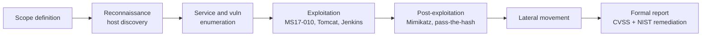

## Key Concepts Demonstrated

- The penetration testing lifecycle: scope, recon, enumeration, exploitation, post-exploitation, and reporting as a disciplined sequence
- Reconnaissance and enumeration: host discovery and service and version enumeration with Nmap, and parsing output for follow-up
- Vulnerability-to-exploit reasoning: mapping discovered services and versions to specific, justified exploits
- Software exploitation: MS17-010/EternalBlue to a Meterpreter shell, plus manual exploitation of vulnerable Tomcat and Jenkins servers
- Post-exploitation tradecraft: credential harvesting with Mimikatz, domain cached credentials, and lateral movement via pass-the-hash
- Professional reporting: executive summary, engagement methodology, attack narrative, technical observations, CVSS severity, and NIST-aligned remediation

## Skills Demonstrated

- Tooling: Nmap, Metasploit, Meterpreter, Impacket, Mimikatz, Kali Linux
- Techniques: host and service discovery, vulnerability discovery, exploitation, privilege escalation, credential harvesting, pass-the-hash
- Analysis and reporting: CVSS scoring, NIST-aligned remediation guidance, structured pentest deliverables

## Walkthrough

### 1. Reconnaissance and host discovery

The engagement began by defining scope and discovering live hosts with Nmap and ICMP-based techniques, establishing the target set before any intrusive activity.

Reconnaissance evidence

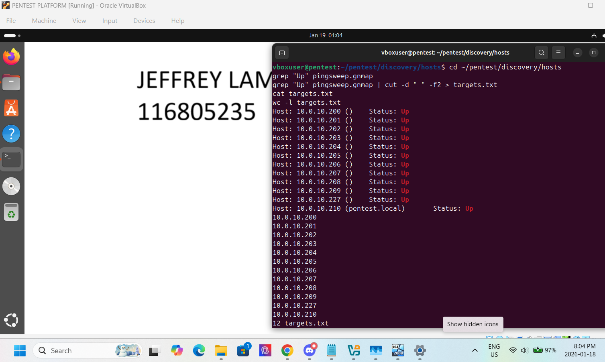
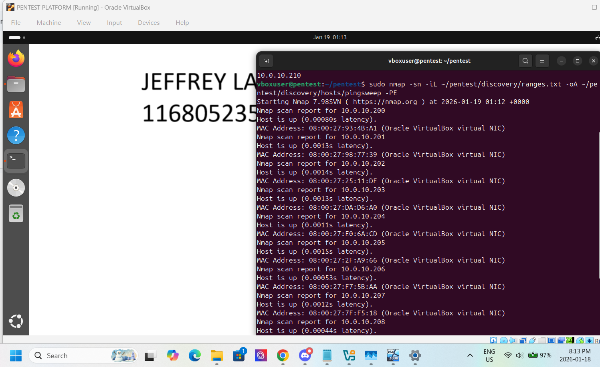
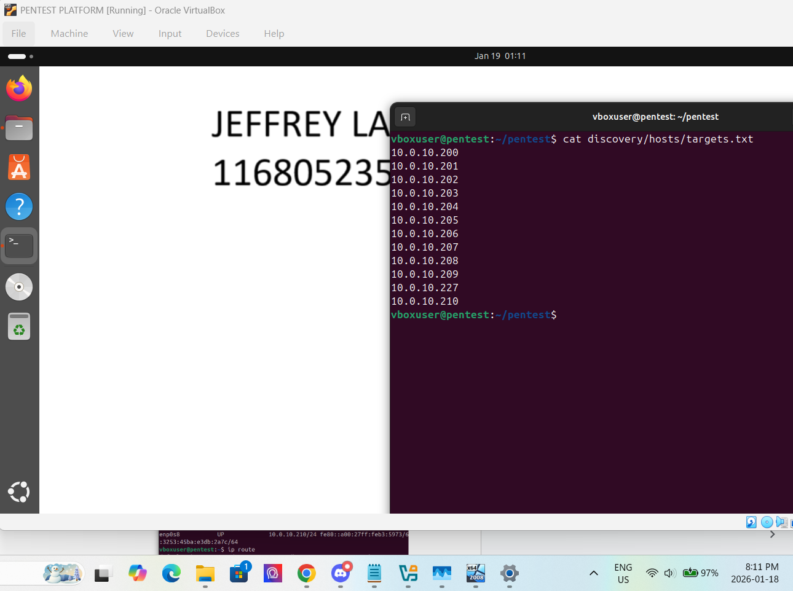
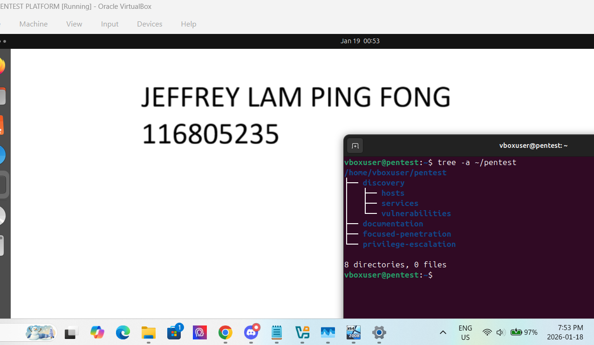

The full set is in the [recon folder](./ris602-lab1).

### 2. Service and vulnerability enumeration

Discovered hosts were enumerated for services and versions, and Nmap output was parsed to identify vulnerabilities worth pursuing. This is the phase that turns a list of open ports into a prioritized target list.

Enumeration evidence

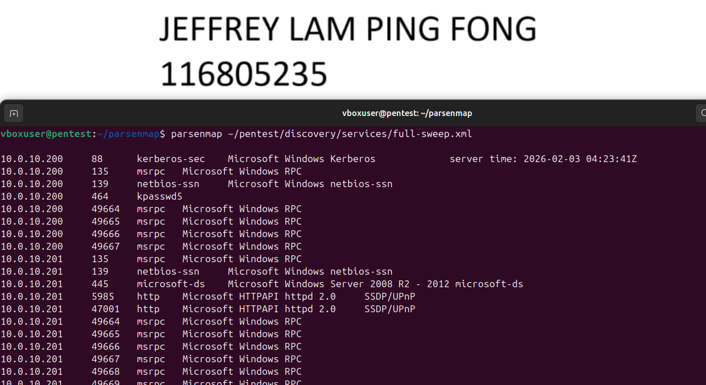
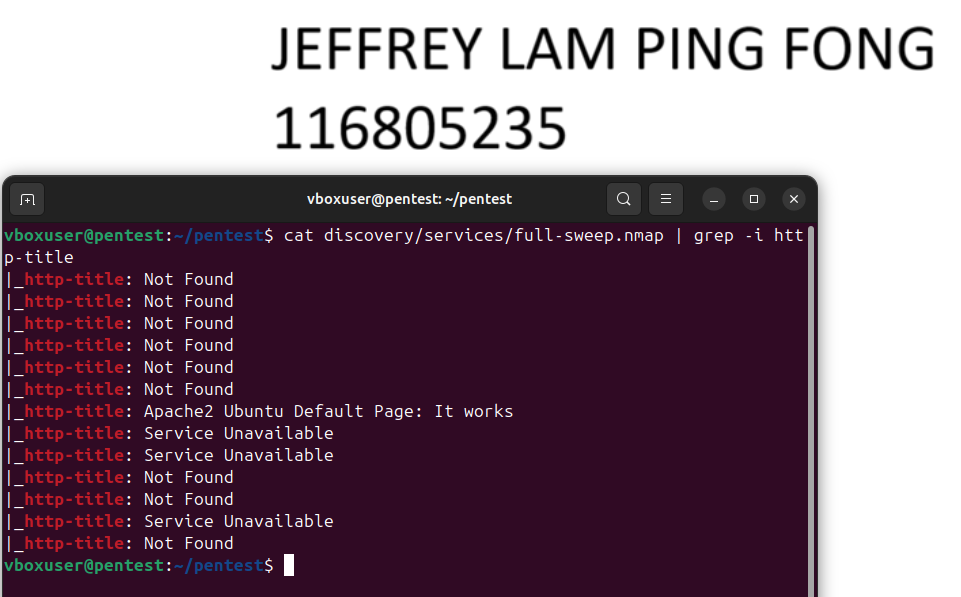
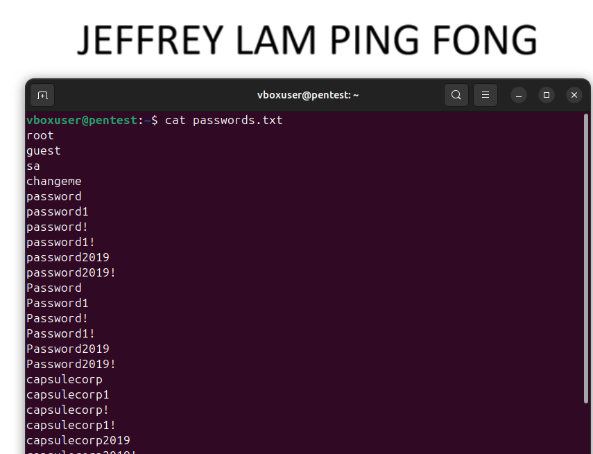
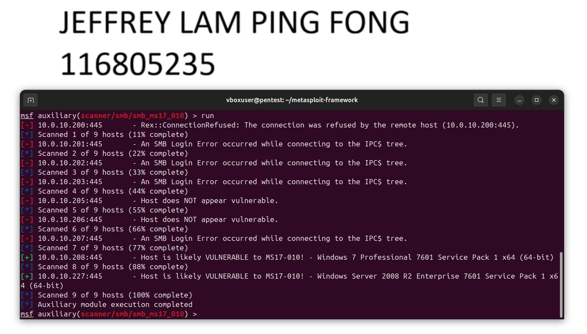

The full set is in the [enumeration folder](./ris602-lab2).

### 3. Focused exploitation

With targets prioritized, vulnerable services were exploited: a Tomcat manager was used to deploy a webshell, a Jenkins Groovy script console was abused for command execution, and a Sticky Keys backdoor was used to reach a SYSTEM-level prompt. These were done manually to demonstrate the underlying flaw rather than relying on a module.

Exploitation evidence

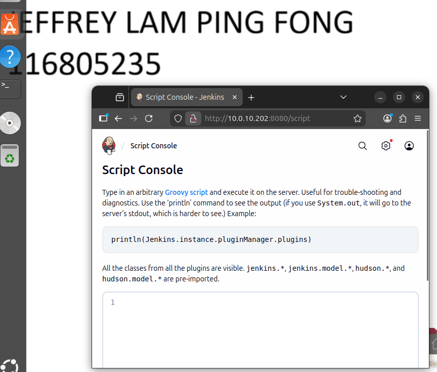

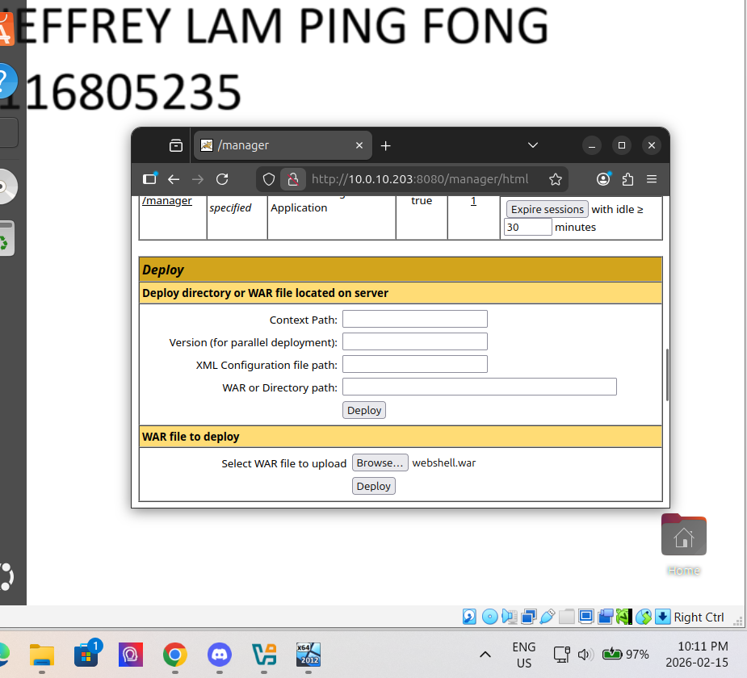
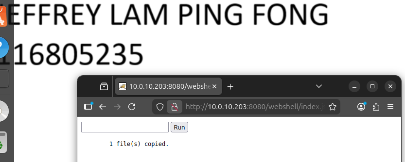

The full set is in the [exploitation folder](./ris602-lab3).

### 4. MS17-010 and post-exploitation

MS17-010/EternalBlue was exploited with Metasploit to obtain a Meterpreter shell, then post-exploitation established reliable re-entry, harvested credentials with Mimikatz and from domain cached credentials, and moved laterally using pass-the-hash. This is the compromise chain that shows how one unpatched host becomes a domain-wide problem.

MS17-010 and post-exploitation evidence

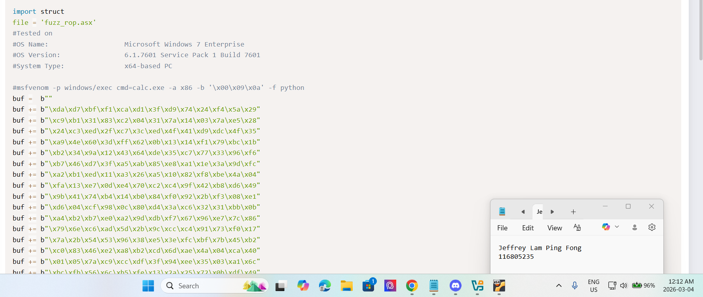

### 5. Reporting

The engagement was written up as a professional penetration test deliverable: executive summary, engagement methodology, attack narrative, technical observations, severity definitions, and appendices, in the format a client or a consulting team would expect.

Reporting deliverable evidence

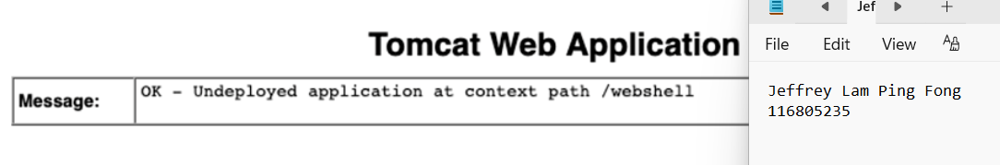

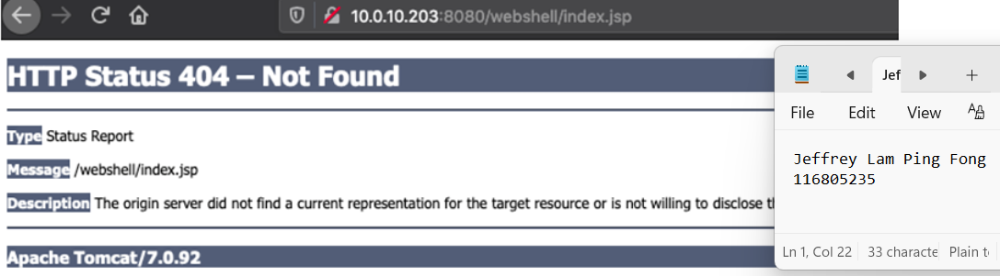

The full set is in the [reporting folder](./ris602-lab6-reporting).

## Lessons Learned

- Reconnaissance quality determines everything downstream: a thorough enumeration phase made the exploitation phase almost obvious, while gaps there would have meant guessing
- Manual exploitation teaches more than modules: deploying a webshell by hand made the Tomcat misconfiguration concrete in a way a one-line Metasploit command would not have
- One unpatched service is enough: MS17-010 to Mimikatz to pass-the-hash is a short path from a single missed patch to domain compromise, which reframes why patching and segmentation are priorities, not chores
- The report is the product: the exploit is worthless to a client if the finding, its severity, and its remediation are not communicated clearly
