# Incident Response and Threat Hunting

An end-to-end incident response to a simulated PsExec intrusion, taken through the full lifecycle: detect the attack across the network and host, contain it, eradicate the foothold, recover to a known-good state, validate, and trace the root cause into concrete hardening. Every stage of the attacker's chain is backed by evidence from a specific sensor.

## Overview

The scenario is a realistic internal compromise. An attacker on Kali Linux (172.16.1.130) used valid local-administrator credentials to reach a domain workstation, WIN-VICTIM (172.16.1.70), over SMB, used Impacket PsExec to gain a SYSTEM-level shell, executed a staged payload, established persistence through a scheduled task and a registry Run key, attempted discovery and lateral movement toward the Active Directory and Services hosts, and completed an HTTP command-and-control callback.

What makes this an incident response project rather than an attack project is the other half: every phase was detected through custom Suricata rules on the router, correlated centrally in Wazuh, and confirmed with Windows event and host evidence. The incident was then contained, eradicated, recovered, and analyzed for root cause, with each response action validated rather than assumed. The root cause (weak local-admin credential control, permissive SMB access, and insufficient segmentation) drove a concrete remediation: a five-VLAN segmentation scheme with a dedicated quarantine VLAN and a default-deny inter-VLAN firewall policy.

### Recovery decision: snapshot revert versus clean-in-place

| Option | Chosen? | Reasoning |
|--------|---------|-----------|
| Revert to a known-good snapshot | Yes | The only way to be confident no persistence or implant remains; fastest path to a trustworthy host |
| Clean the compromised host in place | No | With SYSTEM-level access and multiple persistence mechanisms, you can never fully prove the host is clean |

Cleaning in place was still practiced during eradication to prove the persistence could be removed, but the recovered system was restored from snapshot because a host that had a SYSTEM shell cannot be trusted afterward.

## Attack Chain and Detection Mapping

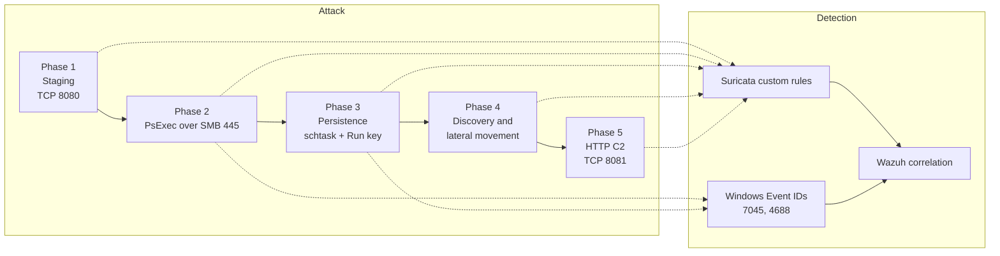

## Key Concepts Demonstrated

- The incident response lifecycle: identification, containment, eradication, recovery, validation, and root-cause analysis as a disciplined sequence
- Multi-source detection: correlating network evidence (Suricata) with host evidence (Windows Event IDs 7045 service creation and 4688 process creation) in a central SIEM
- Attack-chain reconstruction: tying each attacker action to its primary evidence source, key proof, and MITRE ATT&CK technique
- Custom detection engineering: purpose-built Suricata rules for staging, SMB execution, persistence commands, lateral movement, and C2 callbacks
- Root-cause-driven remediation: turning "how did this happen" into VLAN segmentation and a default-deny firewall policy, then validating the fix empirically
- Forensic confirmation: Wireshark HTTP stream reconstruction and host artifact analysis to corroborate the alerts

## Skills Demonstrated

- Incident response: full IR lifecycle execution and documentation
- Detection and correlation: Suricata, Wazuh, Windows event log analysis, custom rule authoring
- Network forensics: Wireshark HTTP stream reconstruction, traffic analysis by port and protocol
- Threat hunting: pivoting from an indicator to the full attack chain across data sources
- Hardening: VLAN segmentation design, default-deny inter-VLAN policy, validated empirically

## Walkthrough

### 1. Identification: detecting each attack phase

Each phase of the intrusion was caught and mapped to evidence. Suricata recorded the Phase 1 payload download over TCP 8080, the Phase 2 SMB activity on TCP 445, the Phase 3 persistence commands, the Phase 4 discovery and lateral-movement attempts, and the Phase 5 HTTP C2 callbacks on TCP 8081, each matching a custom rule SID and each forwarded into Wazuh for central correlation.

Network detection evidence (Suricata across phases 1 to 5)

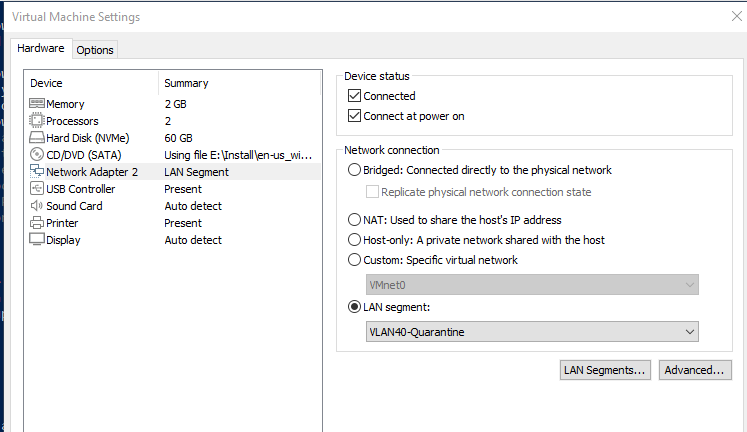
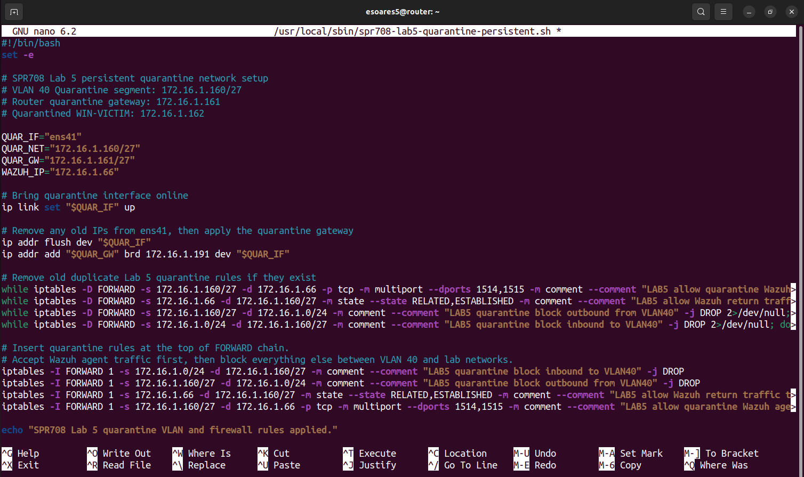
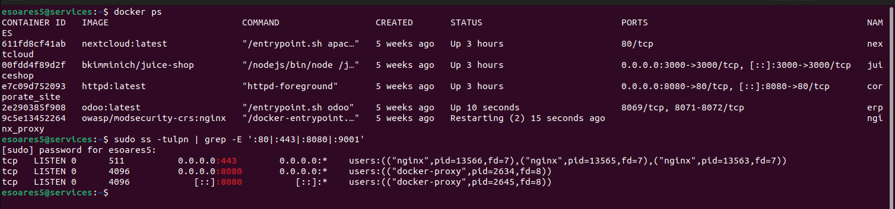
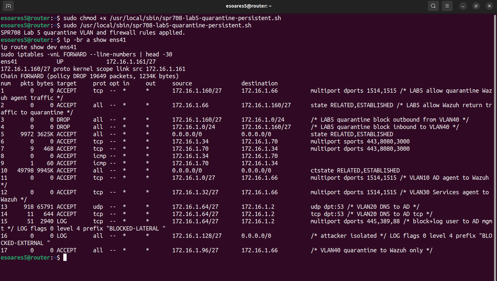
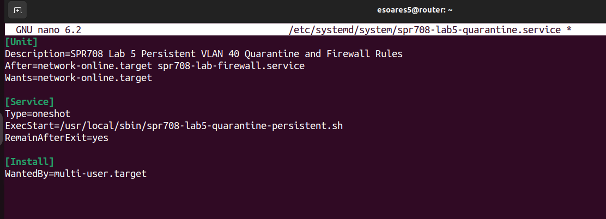

Host confirmation (Wazuh correlation, PsExec SYSTEM shell, Windows Event IDs 7045 and 4688)

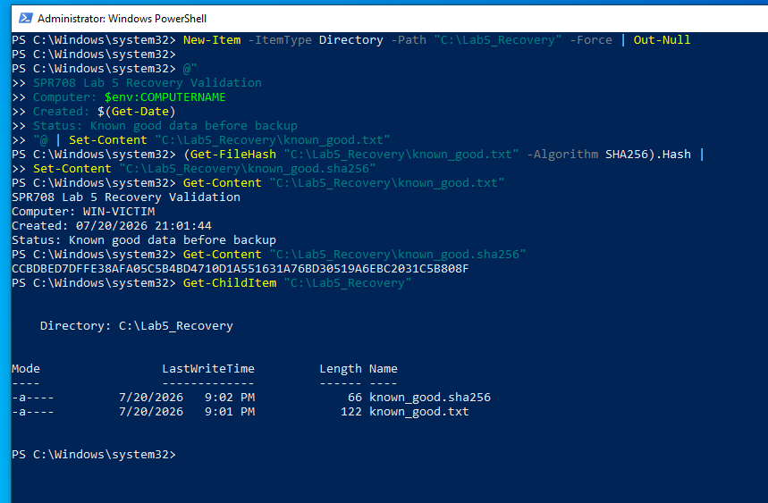
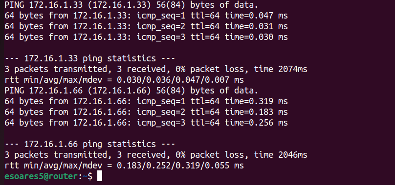
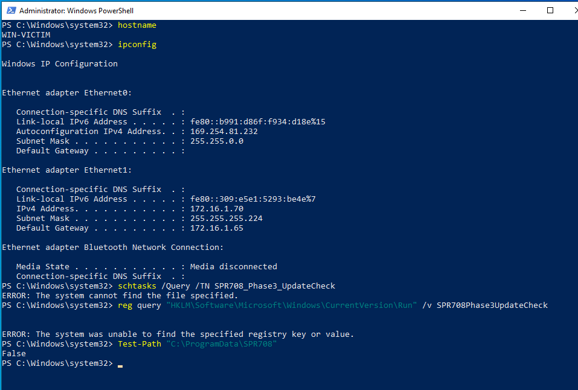
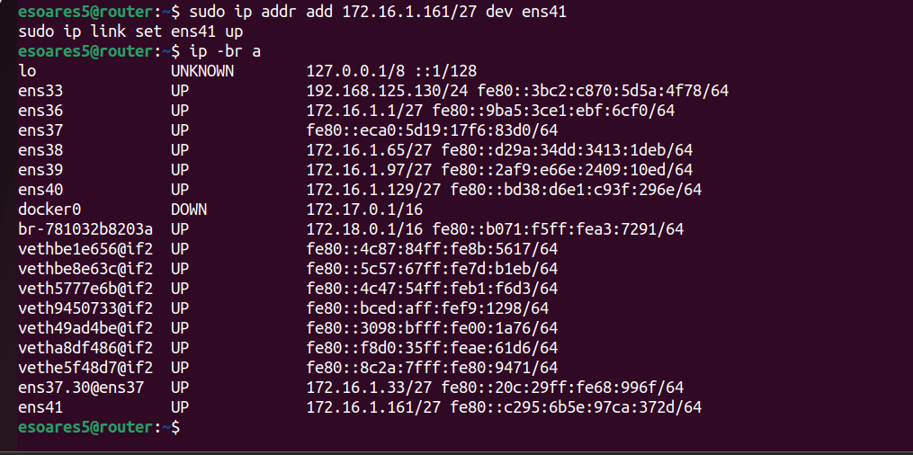
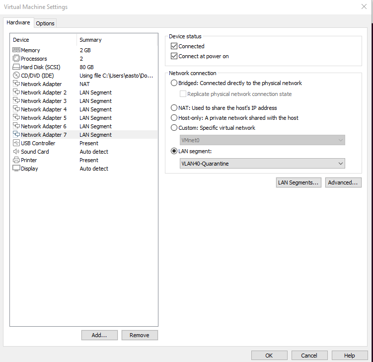

The full set of 62 evidence screenshots is in the [incident-response folder](./spr708-lab5-incident-response).

### 2. Containment, eradication, and recovery

The victim was contained by quarantining it at the router, cutting off the C2 and lateral-movement paths. Eradication removed the malicious files and processes and closed the original access method (the persistence mechanisms and the payload). Recovery reverted the host to a known-good snapshot and confirmed that legitimate services were restored, because a host that had a SYSTEM-level shell cannot be trusted after cleaning alone.

Containment, eradication, and recovery evidence

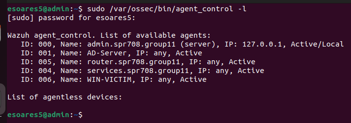
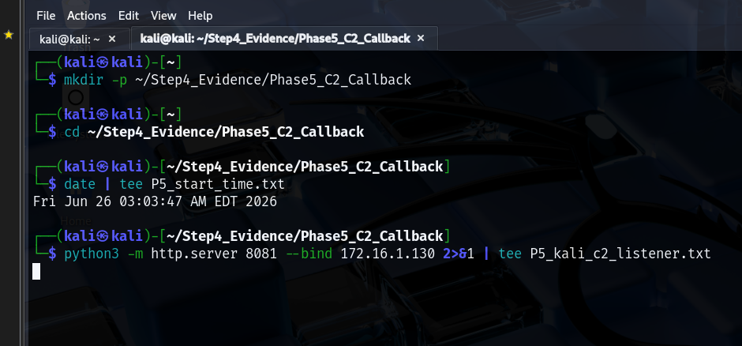
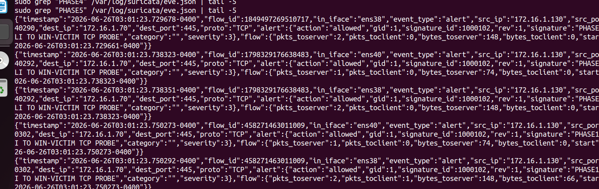

### 3. Validation and root-cause-driven hardening

Response actions were validated (rules and system checks, and confirmation that the hardened configuration persisted). Root-cause analysis identified weak local-administrator credential control, permissive SMB access, and insufficient segmentation, which led to a five-VLAN segmentation scheme with a dedicated quarantine VLAN and a least-privilege, default-deny inter-VLAN firewall policy, both validated empirically.

Validation and hardening evidence

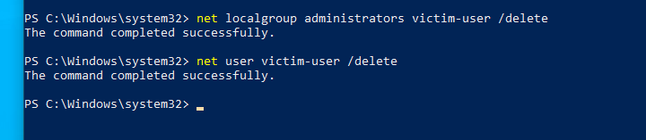
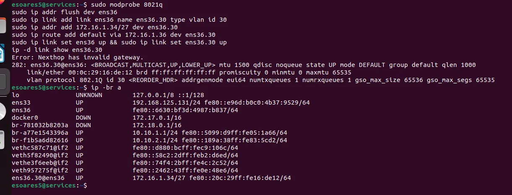
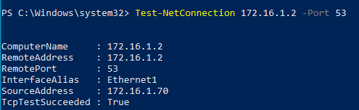

## Team and My Role

This was a Group 11 project (SPR708), completed with Evan Bettencourt, Easton Soares, and Jacob Williams. We worked through it side by side rather than dividing into fixed roles, so I was involved across the whole incident: the attack simulation, the detection and correlation, and the containment and remediation. That is why I can walk through the full lifecycle here rather than only one part.

## Lessons Learned

- Correlation beats any single source: no one sensor told the whole story, but Suricata plus Wazuh plus Windows event logs together reconstructed the entire chain unambiguously
- Containment location matters: quarantining at the router, not the host, is what actually severs C2 and lateral movement
- You cannot clean your way back from SYSTEM: reverting to a known-good snapshot was the only defensible recovery once the attacker had held SYSTEM-level access
- Root cause is a design problem, not an event: the fix was segmentation and default-deny policy, which addresses the class of attack rather than this one instance
