# Web and API Penetration Testing

A full web and API security assessment of a real open-source application (Penpot) deployed in Docker, following the OWASP methodology from reconnaissance through authenticated testing and API abuse, with confirmed vulnerabilities responsibly disclosed and a DevSecOps pipeline built to catch this class of issue automatically.

**[Read the full report (PDF)](./Web_API_Security_Testing_Full_Report.pdf)**

## Overview

This project assesses a production-grade open-source web application rather than a deliberately vulnerable practice target, which means findings had to be discovered and proven, not just located where a lab put them. The assessment covered reconnaissance and vulnerability scanning, authentication and authorization testing, secret management, configuration and runtime review, cryptographic review, and the OWASP API Security Top 10 (broken object-level and function-level authorization, mass assignment, and rate limiting).

Two findings were confirmed and taken through responsible disclosure: CWE-613 (session not invalidated on logout) and CWE-307 (no rate limiting on login, enabling brute force), each written up as a GitHub Security Advisory. A critical configuration finding, a default secret key shipped in the deployment, was also identified. Beyond finding issues, a DevSecOps CI/CD pipeline was built so that secret leakage, code flaws, vulnerable dependencies, and runtime vulnerabilities are caught automatically on every commit, which is how this class of problem is prevented rather than re-discovered.

### DevSecOps pipeline: stage, tool, and what it catches

| Pipeline stage | Tool | What it catches |
|----------------|------|-----------------|
| Secret scanning | gitleaks | Hardcoded credentials and keys committed to the repo |
| Static analysis (SAST) | Semgrep | Insecure code patterns before the app runs |
| Dependency and container scan | Trivy (with a Syft SBOM) | Known-vulnerable components across the dependency tree |
| Dynamic analysis (DAST) | OWASP ZAP | Runtime vulnerabilities against the deployed app |

Building security into CI/CD, rather than testing manually at the end, means a regression is caught the moment it is introduced, which is far cheaper to fix than a finding discovered in an assessment months later.

## Assessment Flow

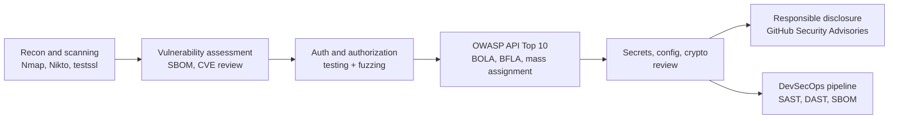

## Key Concepts Demonstrated

- OWASP testing methodology applied to a real application, from recon to authenticated abuse
- The OWASP API Security Top 10: broken object-level authorization (BOLA), broken function-level authorization (BFLA), mass assignment, and rate-limiting failures
- Vulnerability discovery and confirmation: turning scanner output and manual testing into proven, reproducible findings
- Responsible disclosure: documenting CWE-mapped findings (CWE-613, CWE-307) as GitHub Security Advisories
- Software supply-chain security: generating a Software Bill of Materials (SBOM) and scanning dependencies for known vulnerabilities
- Shifting security left: a CI/CD pipeline that runs secret scanning, SAST, container scanning, and DAST on every commit

## Skills Demonstrated

- Web and API testing: Burp Suite Professional, OWASP ZAP, Nikto, testssl.sh, mutation and WebSocket fuzzing
- Vulnerability analysis: CWE and CVE mapping, CVSS severity, SBOM generation and review
- Secure development and DevSecOps: GitHub Actions pipelines with gitleaks, Semgrep, Trivy, and ZAP; hardened Docker Compose
- Reporting and disclosure: vulnerability assessment reports, developer secure-coding guidance, GitHub Security Advisories

## Walkthrough

### 1. Reconnaissance and vulnerability assessment

The deployed application was profiled with Nmap, Nikto, and testssl.sh, a Software Bill of Materials was generated to inventory the dependency tree, and the results were analyzed for known-vulnerable components and misconfigurations, including a comparison of the application's security posture against comparable products.

Vulnerability assessment evidence

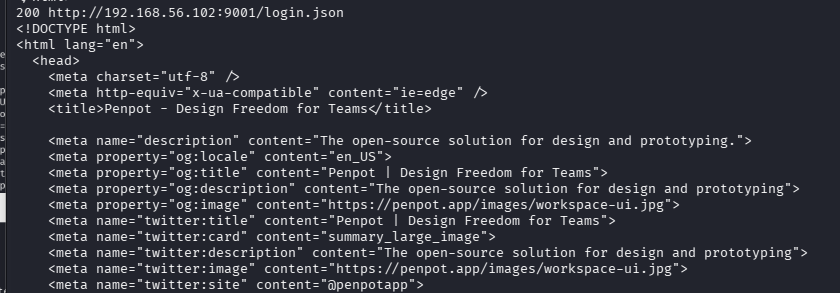
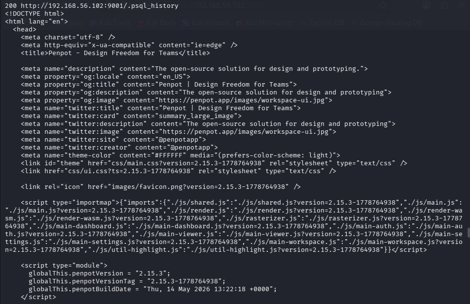
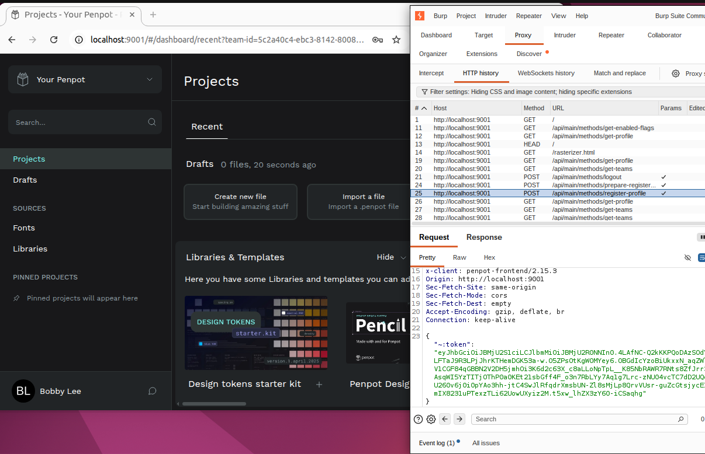
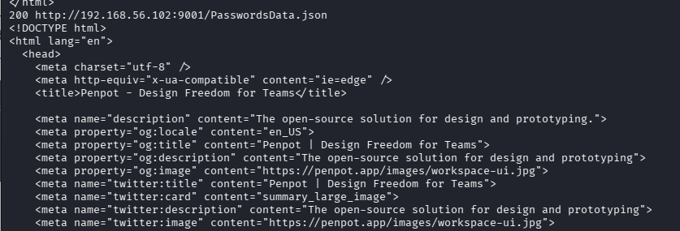
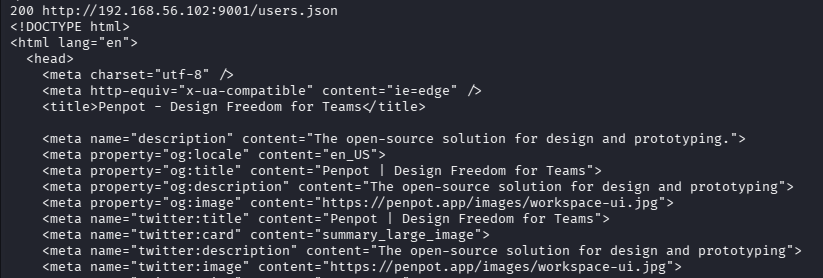

The full set is in the [vulnerability-assessment folder](./was705-lab2-vuln-assessment).

### 2. Authentication, authorization, and API testing

Authenticated testing covered session handling and rate limiting, and the API was tested against the OWASP API Security Top 10, including broken object-level and function-level authorization and mass assignment. This is where the two confirmed findings originated: sessions that were not invalidated on logout (CWE-613) and a login endpoint with no rate limiting (CWE-307).

Auth, authorization, and API testing evidence

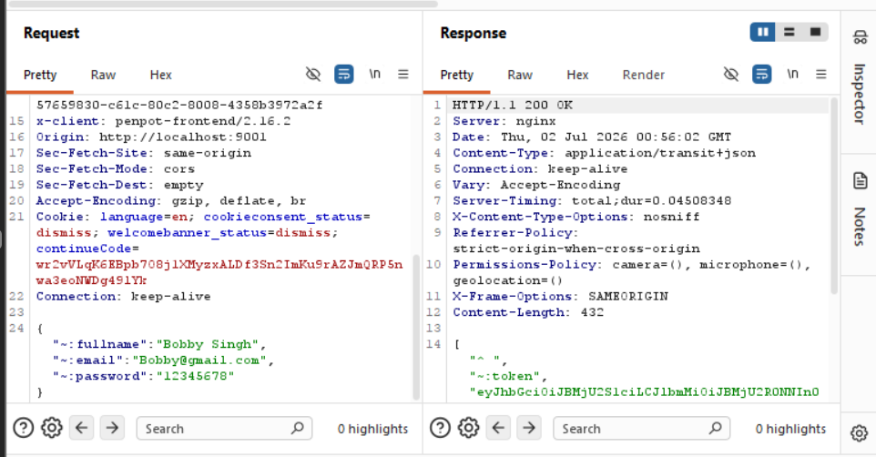
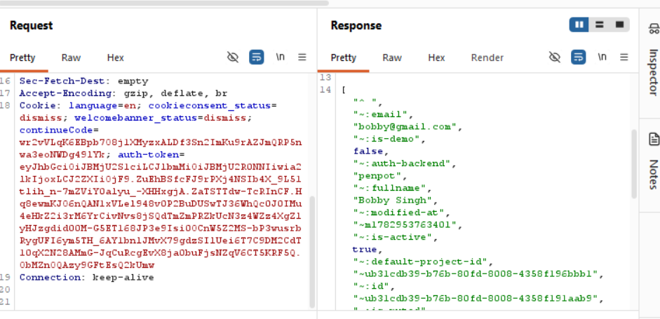
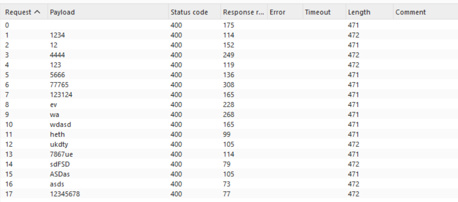
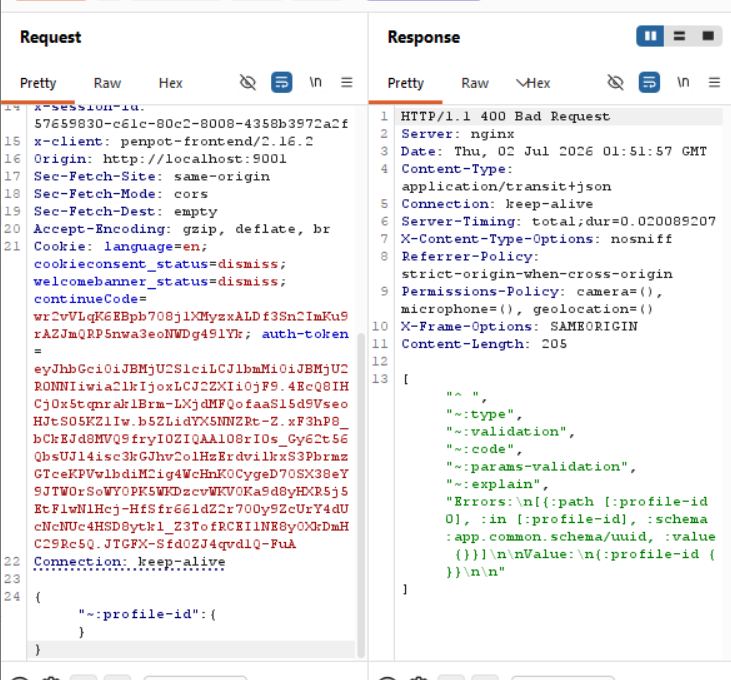
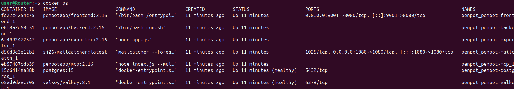

### 3. Secrets, configuration, and cryptographic review

The review covered secret management (identifying a critical default secret key in the deployment), configuration and runtime storage, git history scanning, and cryptographic algorithm and key-management practices, tracing sensitive material through the application rather than only testing the front door.

Secrets, config, and crypto review evidence

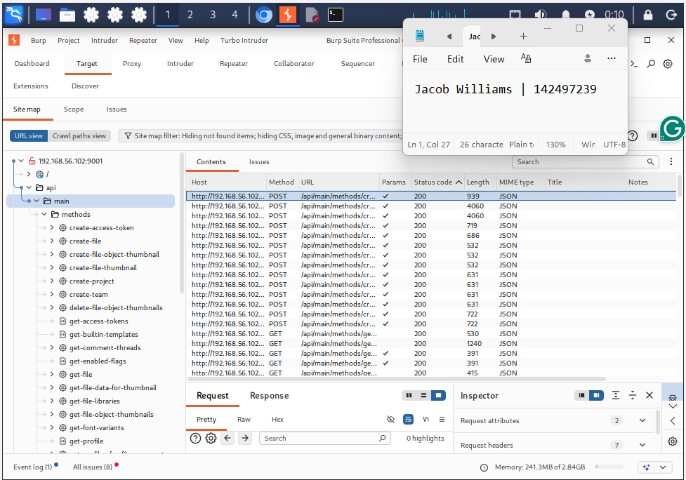
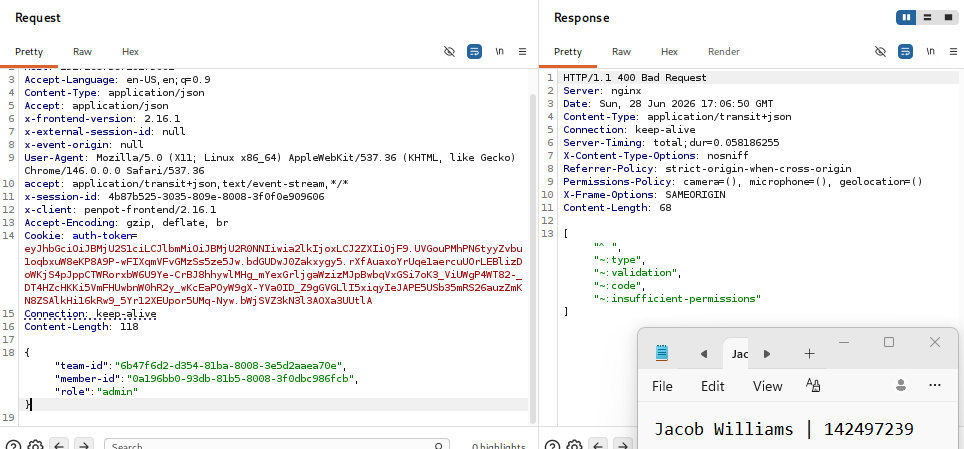
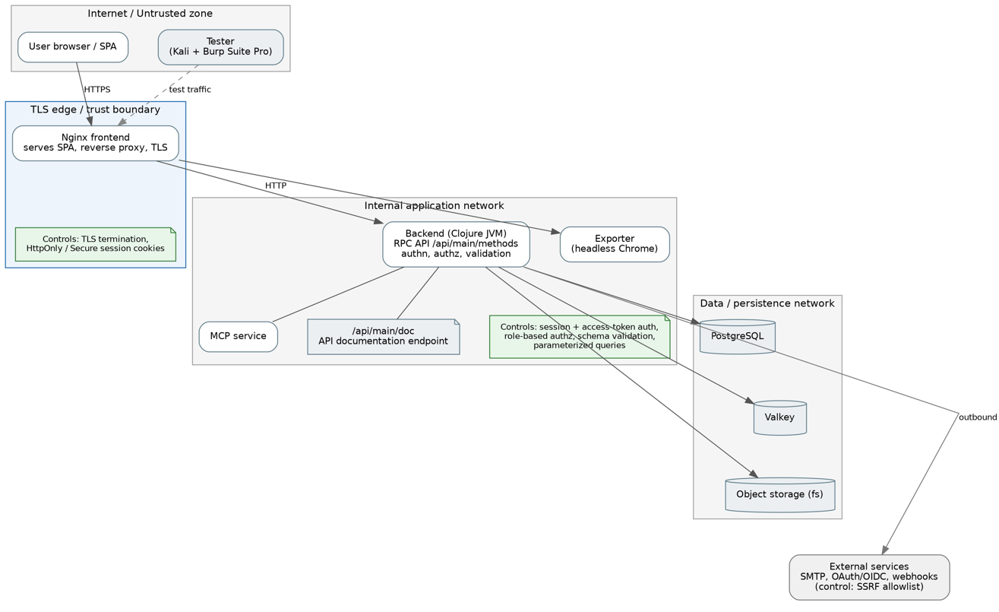

The full set is in the [application-testing folder](./was705-lab4).

## Team and My Role

This was a WAS705 team project assessing the same target application, completed with Evan Bettencourt, Easton Soares, and Jacob Williams. We worked through the assessment together rather than dividing it into fixed roles, so I was hands-on across the testing and the written assessment and secure-coding deliverables. The two confirmed findings were documented as GitHub Security Advisories. I understand the full methodology and can explain each finding, its CWE mapping, and its remediation.

## Lessons Learned

- Real targets do not hand you findings: on a production-grade app, the difference between a scanner hit and a confirmed vulnerability is the manual work of proving it, which is the actual skill
- Configuration is as dangerous as code: a shipped default secret key is a critical issue that no amount of clean application code would fix
- The API is its own attack surface: testing the UI is not enough, and the OWASP API Top 10 catches authorization flaws that traditional web testing misses
- Finding a bug once is worth less than preventing it forever: the DevSecOps pipeline is what turns a one-time assessment into continuous coverage
- Disclosure is part of the job: writing the findings as GitHub Security Advisories made clear that communicating a vulnerability well is as important as finding it
