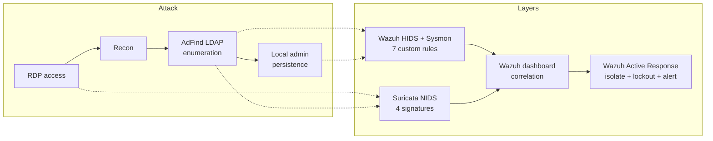
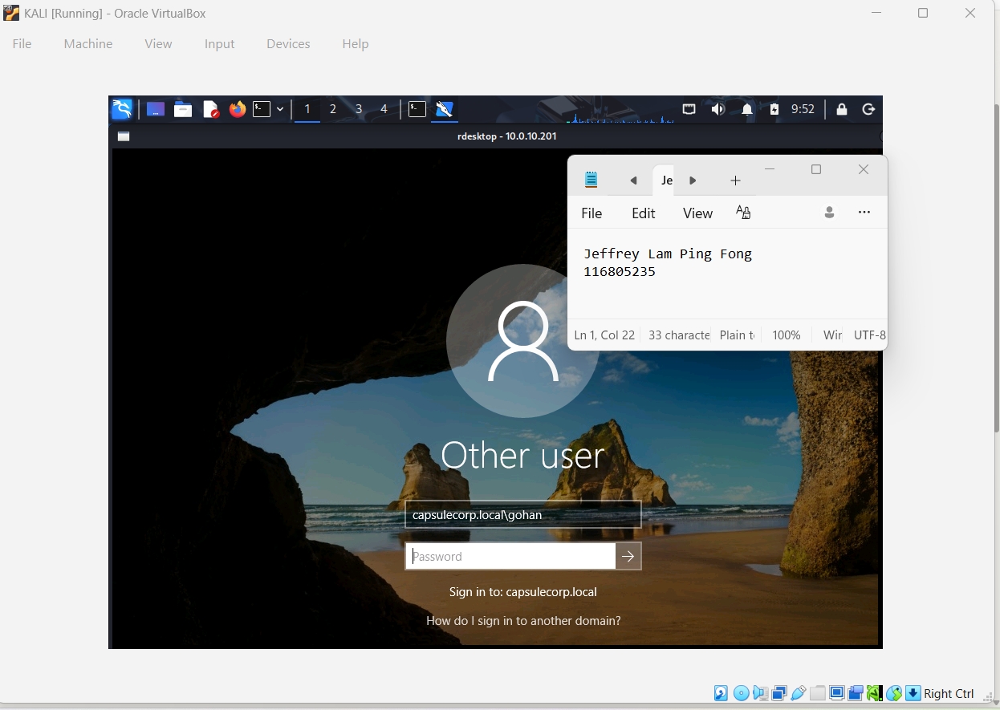
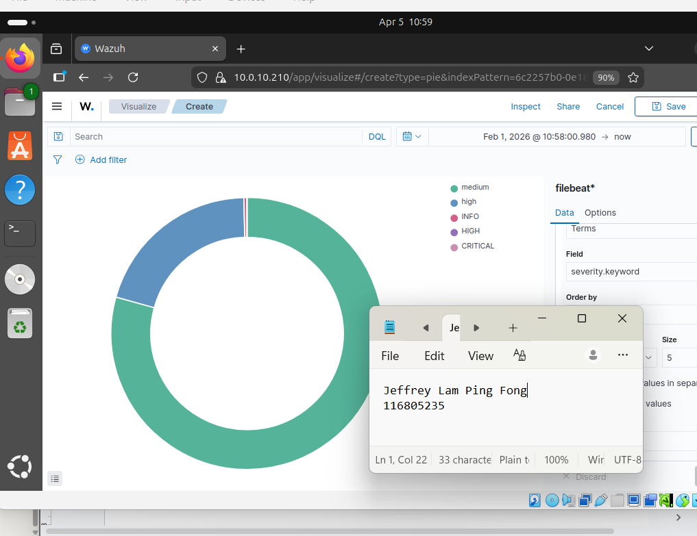
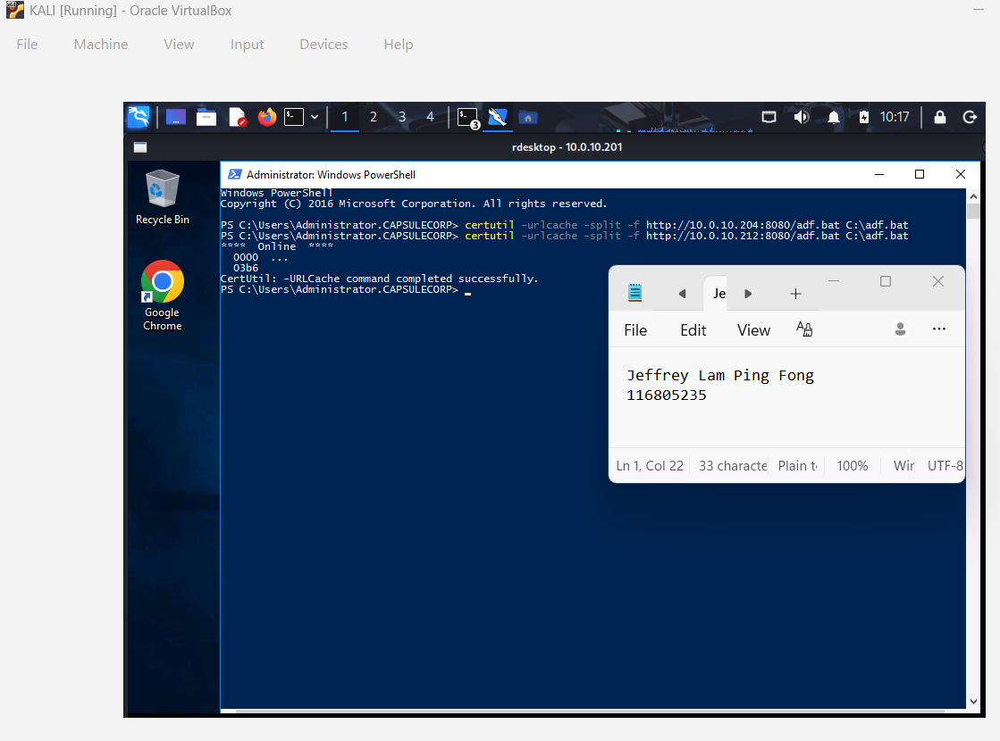
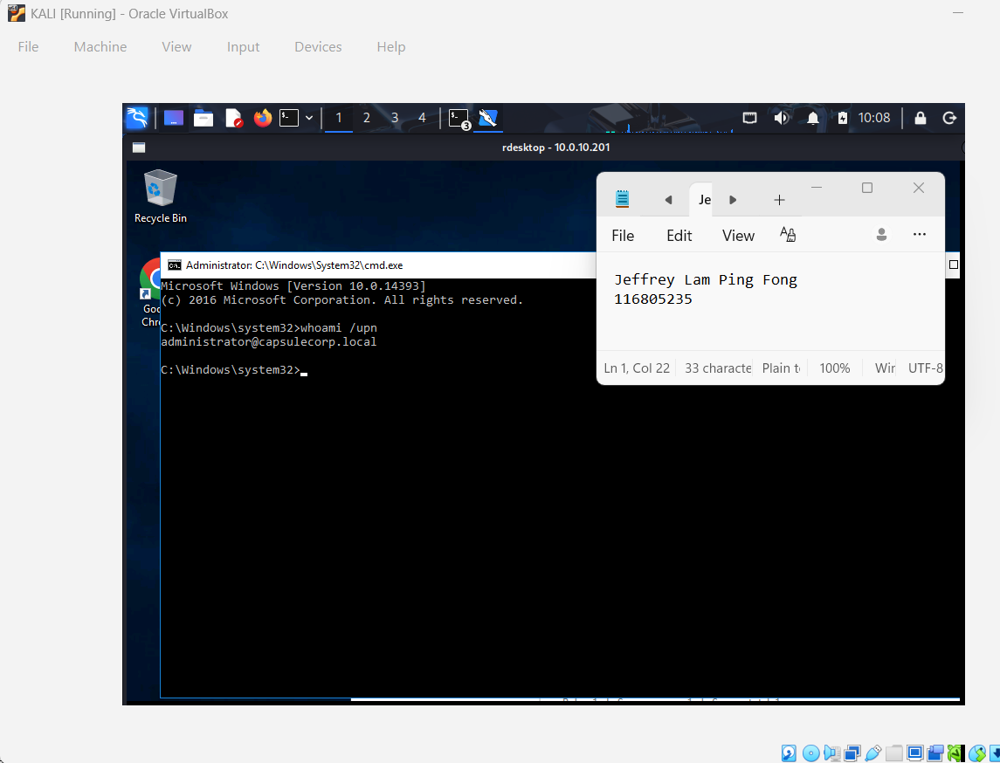
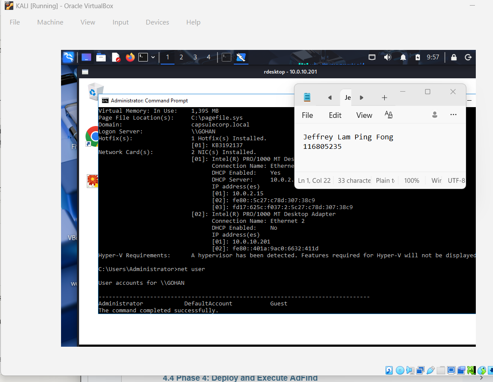

# Threat Hunting: AdFind Recon

An individual threat-hunting and detection-engineering project built on a real documented intrusion, the DFIR Report's "AdFind Recon" case. The attacker's tactics are replicated in a lab, hunted for, and then turned into layered detections and automated response so the same behavior would be caught in future.

**[Read the full report (PDF)](./AdFind_Recon_Report.pdf)**

## Overview

The case study is a common enterprise attack pattern: a threat actor gains access over RDP, uses the AdFind utility to bulk-enumerate Active Directory (users, groups, computers, trusts, and subnets via LDAP), and establishes persistence through a backdoor local administrator account. The exercise replicated this across five phases (initial RDP access, reconnaissance, session reconnect, AdFind execution via a batch file, and persistence) in the Capsulecorp Active Directory lab, then built detection from a hunting hypothesis rather than from prebuilt alerts.

The core skill on display is turning attacker behavior into durable detections. AdFind itself is a legitimate administrative tool, so the detections target its abuse pattern (its specific command-line flags, bulk LDAP WholeSubtree queries, batch-file execution, and out-of-place local account creation) rather than the binary name alone. That distinction, detecting the behavior instead of the tool, is what separates a real hunt from a signature match.

### Why behavior-based detection, not binary blocklisting

| Approach | Chosen? | Reasoning |
|----------|---------|-----------|
| Detect AdFind's abuse behavior (LDAP bulk enumeration, command-line flags, batch execution) | Yes | AdFind is a legitimate admin tool; an attacker can rename it, so the behavior is the reliable signal |
| Block the AdFind binary by name or hash | No | Trivially bypassed by renaming or recompiling, and risks breaking legitimate administrative use |

## Detection Architecture

## Key Concepts Demonstrated

- Threat-hunting methodology: forming a hypothesis from a known TTP, defining IOCs, then searching for evidence across data sources
- Detection engineering across layers: host (Wazuh plus Sysmon), network (Suricata), and correlation (Wazuh dashboard)
- Living-off-the-land detection: catching abuse of a legitimate tool by its behavior, not its name
- MITRE ATT&CK mapping: tying each attacker action (RDP access, discovery, persistence) to its technique
- Security automation: Wazuh Active Response for host isolation and account lockout, plus automated alerting

## Skills Demonstrated

- Threat hunting: hypothesis-driven hunting, IOC development, cross-source pivoting
- Detection engineering: custom Wazuh HIDS rules, Suricata NIDS signatures, Sysmon configuration
- Active Directory attack knowledge: LDAP enumeration, RDP access, local-account persistence
- Automation: Wazuh Active Response scripting for containment and alerting

## Walkthrough

### 1. Replicate the attack

The five-phase attack chain from the case study was replicated in the Capsulecorp AD lab: RDP access, reconnaissance commands, a disconnect-and-reconnect, AdFind Active Directory enumeration executed from a batch file, and persistence via a new local administrator account. Each phase was mapped to MITRE ATT&CK.

### 2. Hunt: hypothesis, IOCs, and detection points

Rather than waiting for an alert, the hunt started from a hypothesis grounded in the known TTP, defined the indicators of compromise to look for, and identified detection points across the infrastructure: endpoint (Wazuh plus Sysmon), network (Suricata), and central log correlation (Wazuh dashboard).

### 3. Engineer the detections

Detections were authored across two layers: seven custom Wazuh HIDS rules (AdFind execution, AdFind command-line arguments, batch-file execution, local account creation, and suspicious RDP logon) and four custom Suricata NIDS signatures (LDAP reconnaissance, LDAP WholeSubtree search, external RDP access, and AdFind binary transfer), backed by the Sysmon configuration needed to surface the host telemetry.

### 4. Automate the response

Wazuh Active Response automated containment: a host-isolation response script, automated account lockout for the backdoor account, and automated alerting, so detection leads directly to action rather than just a dashboard entry.

Threat hunt and detection evidence (attack simulation, Wazuh and Suricata detections, automated response)

## Lessons Learned

- Hunt the behavior, not the tool: detecting the abuse pattern (bulk LDAP enumeration and specific command-line flags) holds up where blocking the binary by name would be bypassed with a rename
- A hypothesis makes a hunt repeatable: starting from a known TTP and defined IOCs turned "look for something bad" into specific, testable detections across host and network
- Detection should lead to action: wiring Wazuh Active Response into the detections turned alerts into automatic containment, which is the difference between visibility and defense
- Real case studies are the best training: rebuilding a documented DFIR intrusion end to end taught the attacker's tempo and artifacts far better than an abstract exercise would have
