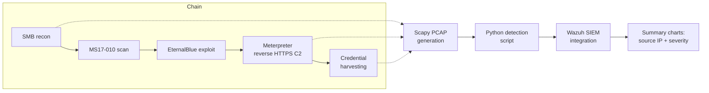
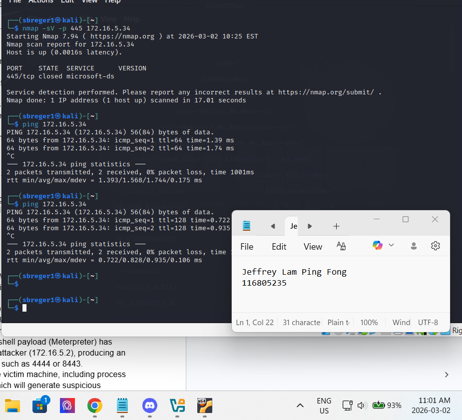
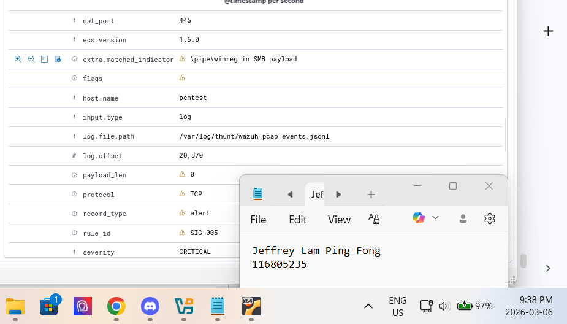
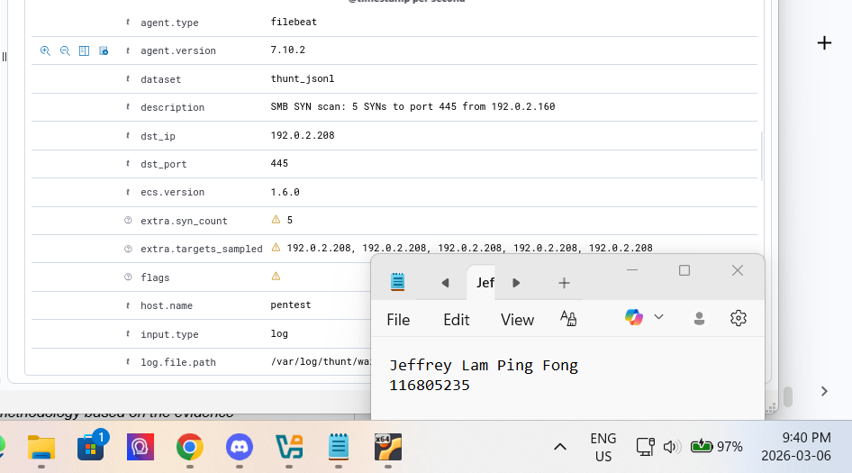
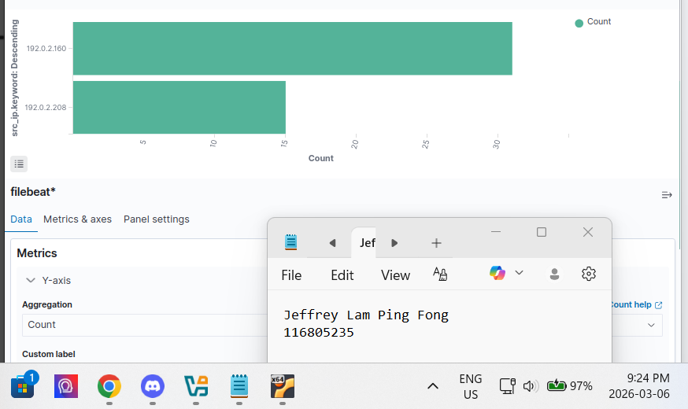
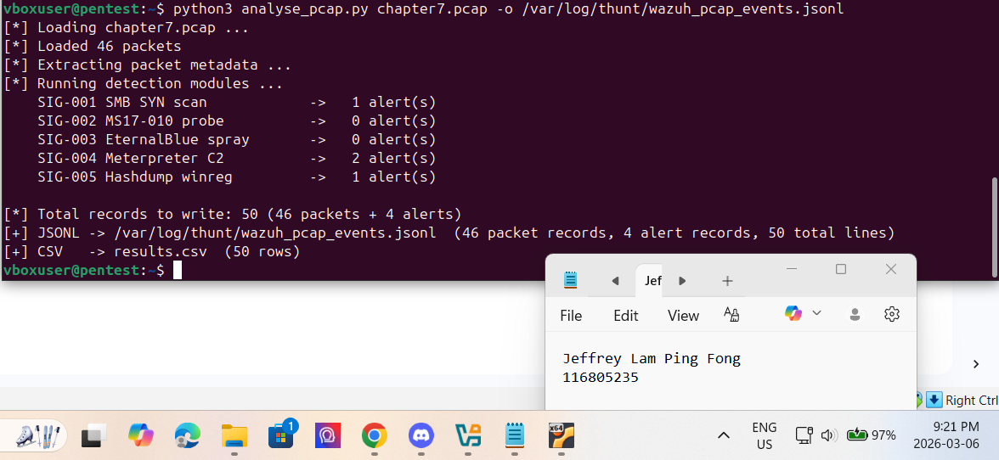
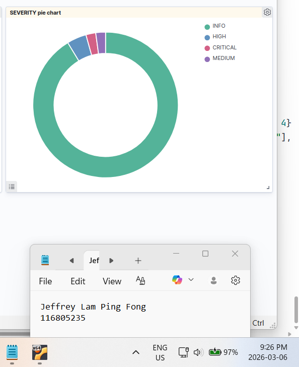
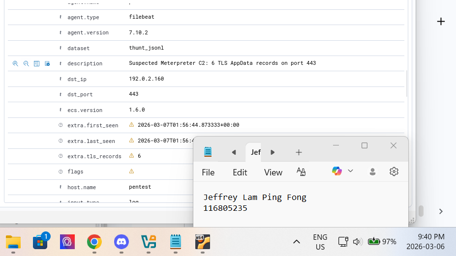
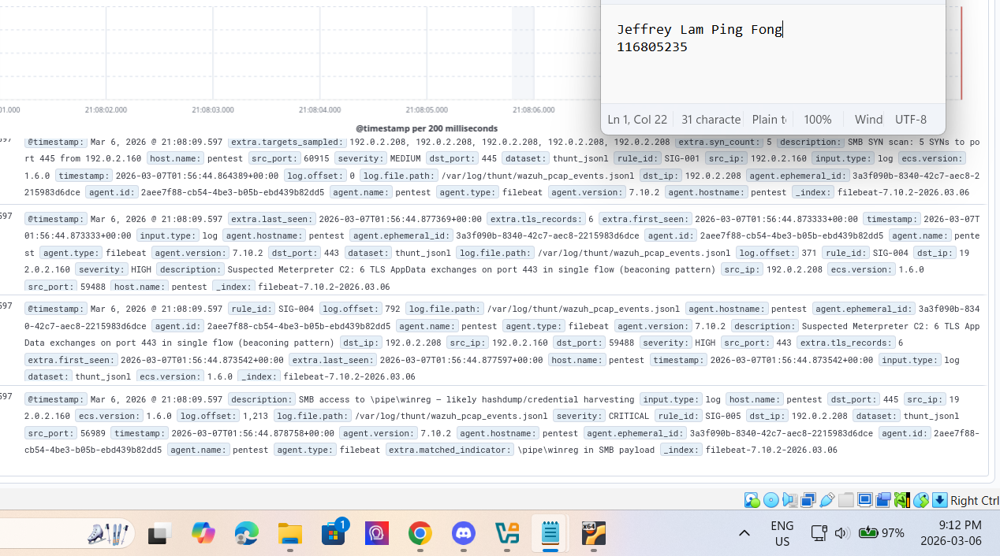
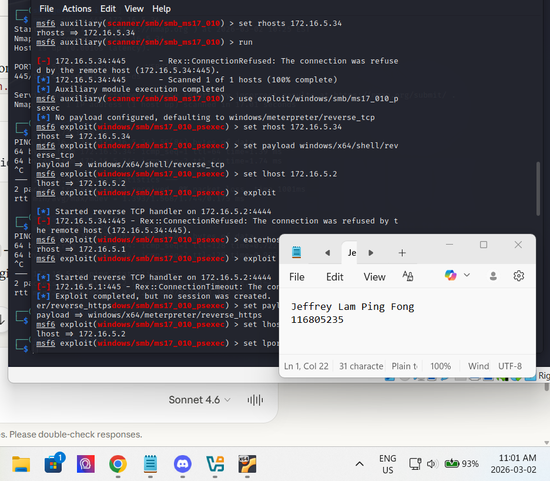

# Threat Hunting: EternalBlue Detection

An individual, two-phase threat-hunting and detection project targeting the MS17-010 (EternalBlue) attack chain against the Windows SMB service. It pairs manual threat hunting with an automated, PCAP-driven detection pipeline, and documents honestly how a lab failure in the live phase was recovered by generating synthetic traffic to validate the detections.

## Overview

The exercise targets a well-documented five-stage attack chain from Chapter 7 of The Art of Network Penetration Testing: SMB reconnaissance, MS17-010 vulnerability scanning, EternalBlue exploitation, a Meterpreter reverse-HTTPS command-and-control channel, and post-exploitation credential harvesting. The goal was to evaluate both manual and automated detection against that chain.

Phase 1 was a live simulated attack (Kali against a Windows victim, with Wazuh, Suricata, Wireshark, and tcpdump as the defensive stack). During the lab a network misconfiguration prevented reliable attacker-to-victim connectivity, so the live exploitation did not execute and no live artifacts were captured. Rather than paper over that, the report records the Phase 1 findings honestly as insufficient data and moves the detection work into Phase 2, where synthetic PCAPs were generated with Scapy to reproduce each stage's network signature, an automated Python detection script parsed them, and the results were integrated into Wazuh with summary visualizations. This is the more valuable version of the story: a real setback, a documented root cause, and a working recovery that still proved the detections.

### Why synthetic PCAP generation, not only live capture

| Approach | Role in this project | Reasoning |
|----------|----------------------|-----------|
| Live traffic capture (Phase 1) | Attempted, then blocked | A network misconfiguration prevented connectivity, so no live artifacts were produced |
| Synthetic PCAP generation with Scapy (Phase 2) | Primary detection dataset | Reproduces each attack stage's packet signature deterministically, so detections can be built and validated without depending on a fragile live lab |

Generating traffic synthetically also makes the detection repeatable and shareable: anyone can rerun the same PCAPs and get the same alerts, which a one-off live capture cannot offer.

## Detection Pipeline

## Key Concepts Demonstrated

- Manual and automated threat hunting compared against the same documented attack chain
- Synthetic network traffic generation with Scapy to reproduce attack-stage signatures deterministically
- Detection automation: a Python script that parses PCAPs and raises findings, integrated into Wazuh
- MITRE ATT&CK mapping: each of the five attack scenarios tied to its technique in a structured threat assessment
- Honest reporting: recording insufficient-data findings and a root-cause for the live-phase failure rather than fabricating results
- Analyst-facing visualization: source-IP traffic distribution and severity distribution summaries

## Skills Demonstrated

- Threat hunting: manual hunting strategy, detection techniques, and structured threat assessment
- Detection engineering and automation: Scapy PCAP generation, Python detection scripting, Wazuh integration
- Network analysis: Wireshark, tcpdump, SMB and HTTPS C2 traffic interpretation
- Frameworks and reporting: MITRE ATT&CK mapping, severity classification, formal report writing

## Walkthrough

### Phase 1: Manual threat hunting

Phase 1 set up a live attack (Kali versus a Windows victim) with Wazuh, Suricata, Wireshark, and tcpdump as the defensive stack, and defined the manual hunting strategy, tools, and detection techniques for the five-stage chain. A network misconfiguration during the lab blocked attacker-to-victim connectivity, so exploitation never ran and no live artifacts were captured. The findings for this phase are recorded as insufficient data, with the misconfiguration documented as the root cause.

### Phase 2: PCAP creation, automated detection, and SIEM integration

To recover the objective, each attack stage's network behavior was reproduced with Scapy-generated PCAPs, an automated Python detection script parsed the captures and raised findings, and the results were integrated into Wazuh with summary visualizations (source-IP traffic distribution and severity distribution). This phase produced concrete detections for SMB reconnaissance (SYN scan), the Meterpreter reverse-HTTPS C2 channel, and post-exploitation credential harvesting.

Automated detection evidence (Scapy PCAPs, detection script, Wazuh integration, summary charts)

### Threat assessment

Each of the five stages was written up as a threat scenario with a description and a MITRE ATT&CK mapping: SMB service reconnaissance (port scanning), MS17-010 vulnerability scanning, EternalBlue remote code exploitation, Meterpreter reverse-HTTPS C2, and post-exploitation credential harvesting.

## Lessons Learned

- Document failure honestly: recording the live phase as insufficient data with a clear root cause is more credible, and more useful, than hiding a lab that did not work
- Synthetic traffic rescues a broken lab: Scapy-generated PCAPs let the detection work continue and made it repeatable, turning a dead end into a working deliverable
- Automating detection scales the analysis: a script that parses PCAPs and raises findings is faster and more consistent than manual packet review, and it produces the summaries an analyst actually reads
- Manual and automated hunting are complementary: the manual phase builds the intuition for what to look for, and the automated phase turns that into repeatable coverage
