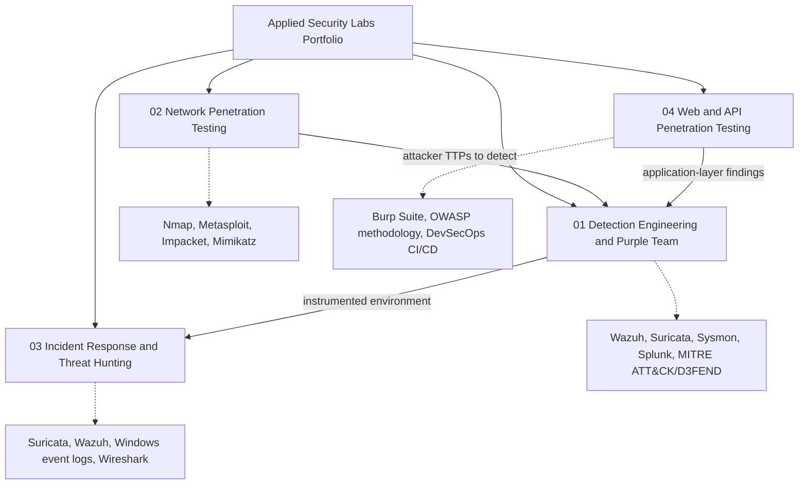

# Applied Security Labs Portfolio

A consolidated portfolio of four hands-on security projects spanning the full attack-and-defend lifecycle: building and detecting attacks, exploiting networks, responding to a live intrusion, and assessing a real web application. Each project pairs a written walkthrough with the evidence screenshots from the original engagement, so the reasoning behind each step is visible, not just the result.

## Overview

Most security learning stops at "I ran the tool." The goal of this portfolio is to show the layer underneath: why a control was chosen, what an attacker's behavior actually looks like on the wire and on the host, and how a defender turns that behavior into a detection or a remediation. The four projects were built on self-hosted, isolated lab infrastructure (VirtualBox and Docker) rather than pre-canned platforms, so every log source, firewall rule, and detection was configured by hand and can be explained end to end.

The work is deliberately organized around the way these disciplines connect in practice. An attack is only useful to a defender if it is detectable, so the offensive work (network penetration testing, adversary emulation, a ransomware simulator) feeds directly into the defensive work (detection engineering, SIEM correlation, incident response). This is the purple-team mindset: attack to understand, then instrument to catch.

### A note on collaboration

Three of these four projects were team projects completed as Group 11 in my program (SPR708 and SPR600), and the web application assessment was a shared WAS705 project. I did not build every piece alone, and the per-project READMEs name who led what. My own role across the SPR708 work was the cyber threat intelligence (CTI) lead: I owned the threat-actor selection, the ATT&CK/TTP mapping that drove each exercise, and the reporting. I have included these because I understand each project in full, including the components my teammates led, and can walk through any part of them. The network penetration testing project (RIS602) was my individual coursework.

## Repository Map

## Projects

| # | Project | What it demonstrates | Type |
|---|---------|----------------------|------|
| 01 | [Detection Engineering and Purple Team](./01-detection-engineering-purple-team) | Building an instrumented enterprise environment, emulating a real adversary, and engineering detections for each stage | Team (Group 11) |
| 02 | [Network Penetration Testing](./02-network-penetration-testing) | Full-cycle internal network penetration testing, exploitation, post-exploitation, and formal reporting | Individual |
| 03 | [Incident Response and Threat Hunting](./03-incident-response-threat-hunting) | End-to-end response to a simulated PsExec intrusion: detect, contain, eradicate, recover, root-cause | Team (Group 11) |
| 04 | [Web and API Penetration Testing](./04-web-api-penetration-testing) | OWASP-methodology assessment of a real containerized web app, with confirmed CVE-class findings and a DevSecOps pipeline | Team (WAS705) |

## Key Concepts Demonstrated

- Purple-team workflow: emulating an adversary specifically to test and improve detection coverage, rather than attacking or defending in isolation
- Detection engineering: writing custom Suricata and Sysmon rules mapped to MITRE ATT&CK techniques and validating them against real attack traffic
- The full incident-response lifecycle: identification, containment, eradication, recovery, validation, and root-cause analysis
- Attacker tradecraft: initial access, execution, persistence (scheduled tasks and registry Run keys), discovery, lateral movement, and command-and-control
- Defense-in-depth and least privilege: network segmentation, default-deny firewalling, and hardening validated empirically rather than assumed
- Framework-driven analysis: MITRE ATT&CK and D3FEND for attack and defense mapping, NIST and CIS Controls for hardening, OWASP and CVSS for application risk

## Skills Demonstrated

- Detection and monitoring: Wazuh SIEM, Suricata IDS, Sysmon, Splunk, log correlation, custom rule authoring
- Offensive security: Nmap, Metasploit, Impacket, Mimikatz, Burp Suite Professional, OWASP testing methodology
- Incident response and forensics: attack-chain reconstruction, Windows event analysis, Wireshark stream reconstruction, Autopsy
- Infrastructure: Active Directory, VirtualBox and Docker lab design, VLAN segmentation, firewall policy, PKI
- Frameworks and reporting: MITRE ATT&CK/D3FEND, NIST, CIS Controls, OWASP Top 10, CVSS, formal technical report writing

## Author

Jeffrey Lam-Ping-Fong
[LinkedIn](https://www.linkedin.com/in/jeffrey-lam-ping-fong-07a649321/) · [GitHub](https://github.com/jeff6942016)

Honours Bachelor of Information Technology (Cybersecurity), Seneca Polytechnic.
